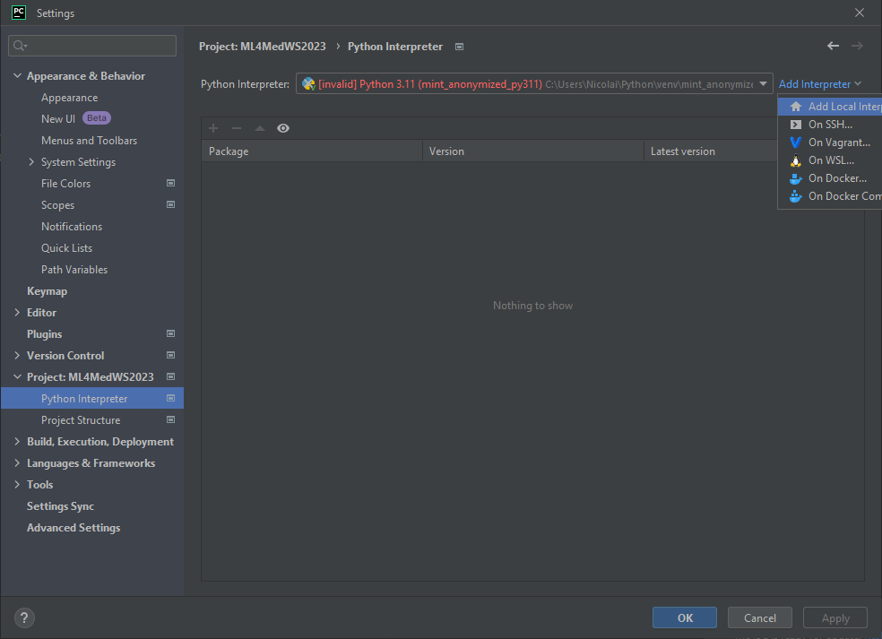
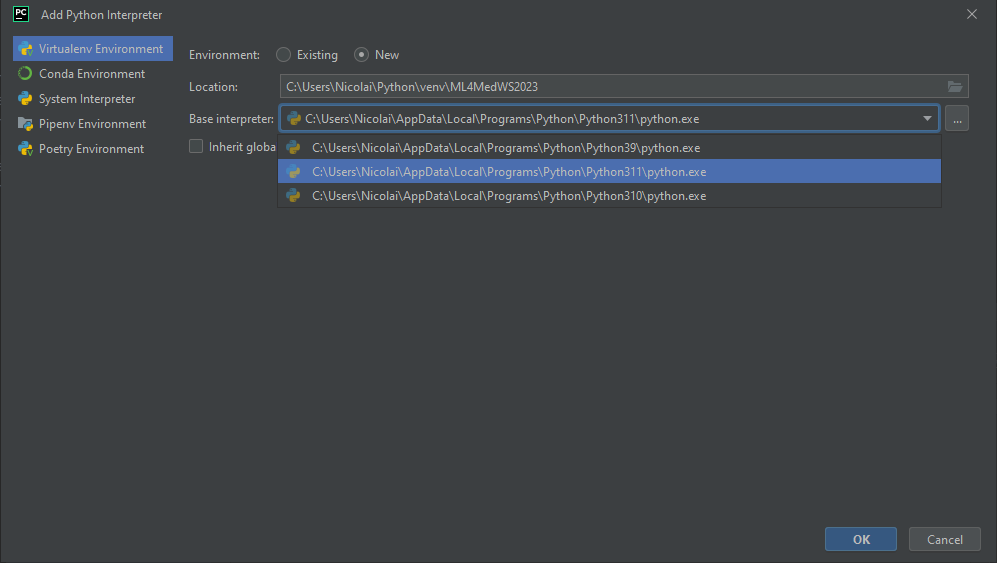

# ML4MedWS2023
Project for ML4Med in WS 2023

If you encounter any errors, problems or have suggestions, please feel free to **improve this read me**.

# Get Started
## Change data path
look for "data_dir = r'C:\Users\Nicolai\PycharmProjects\ML4MedWS2023\Data\ConvertedPelvisNiftiDataset\Converted Pelvis Nifti Dataset'"

## Run Code
if the vanilla training runs, try out your self different parameters and models and so on. For that please copy "Code/MONAI/your_custom_training.py" and rename it and then customize it.
# Data
## Original Dataset
https://universe.roboflow.com/ks-fsm9o/pelvis-ap-x-ray/dataset/2
## Nifti source by Niklas Koser
https://cloud.rz.uni-kiel.de/index.php/s/WRM33znRQjLcMZo

the data ist not included in this repository, because it is too large.
but you can automatically download it by running "Code/GetData/GetData.py" in "Code/GetData"

# MONAI
## Tutorial Source
https://github.com/Project-MONAI/tutorials/blob/main/3d_segmentation/spleen_segmentation_3d.ipynb

# Python Environment

## by venv in PyCharm

1. Open Project in PyCharm
2. Open Settings -> Project -> Python Interpreter
3. Add new Python Interpreter

4. Select "Add Local Interpreter"
5. Select "New environment using Virtualenv"
6. Select a Python Version (e.g. 3.11)

7. Now you have a clean new Python Environment for a specific Python version
8. Install all required packages via 
'pip install -q "monai-weekly[gdown, nibabel, tqdm, ignite]"' 
and 
'pip install -q "matplotlib"' 
and 
'pip install -q "SimpleITK"'
and 
'pip install -q "pandas, scipy"'